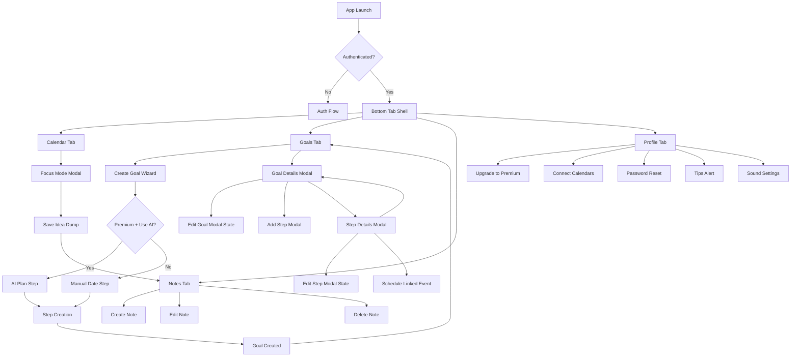

# UX Flow Map

## Purpose
Map user flows for all four tabs, modal transitions, and key branch points so implementation can follow a predictable route structure.

## Global Navigation
- Primary navigation is bottom tabs:
  - Calendar
  - Goals
  - Notes
  - Profile
- Modals are layered per-tab where needed.

## App Entry Flow
1. Launch app.
2. Resolve auth session.
3. If signed out, show auth flow.
4. If signed in, enter tab shell.

## Calendar Flow
1. User lands on Calendar tab.
2. User views day/week/month context.
3. User taps calendar event to inspect details (future enhancement modal).
4. User taps FAB to open Focus Mode.
5. Focus Mode shows current event name, countdown, and Idea Dump input.
6. User saves Idea Dump entry.
7. App creates note and returns to Focus Mode or Calendar.

## Goals Flow
1. User lands on Goals tab and sees goal cards.
2. User taps FAB to start Create Goal wizard.
3. Wizard sequence:
   - SMART education
   - Goal input
   - Premium AI branch or manual branch
   - Completion date (manual path)
   - Step creation
   - Finish
4. User taps existing goal card.
5. Goal Details modal opens (read mode).
6. User options in Goal Details:
   - Edit goal
   - Add step
   - Reorder steps (drag handle)
   - Tap step card to open Step Details
   - Close modal
7. Step Details modal options:
   - Edit step
   - Schedule event tied to goal + step
   - View linked event list
   - Back to Goal Details

## Notes Flow
1. User lands on Notes tab and sees note cards.
2. User taps FAB to create note.
3. User views, edits, or deletes notes.
4. Idea Dump-created notes appear in same list with source metadata.

## Profile Flow
1. User lands on Profile tab.
2. User can:
   - Manage account
   - Upgrade to premium
   - Reset password
   - Connect external calendars (Apple, Google, Microsoft)
   - Open life wisdom/tips alert
   - Configure alarm and reminder sounds

## Modal and Transition Graph

## Route and State Planning Notes
- Keep tab routes stable for analytics and deep linking.
- Keep Goal Details and Step Details as explicit modal routes for predictable back behavior.
- Ensure Step Details back action always returns to Goal Details (not directly to tab root).
- Preserve pending form state during multi-step wizard transitions.

## Edge Cases to Validate
- Focus Mode with no active event.
- Goal wizard cancellation at each step.
- Reordering steps while some are completed.
- Creating event from Step Details when calendar connection is unavailable.
- Deleting notes created from Idea Dump without breaking source references.

## Test Coverage Targets (Behavior-Oriented)
- Tab switching and route stability.
- Goal wizard branching (AI path vs manual path).
- Modal back-stack correctness (Goal Details <-> Step Details).
- Idea Dump save path to Notes list visibility.
- Profile actions navigation and success/error feedback.
